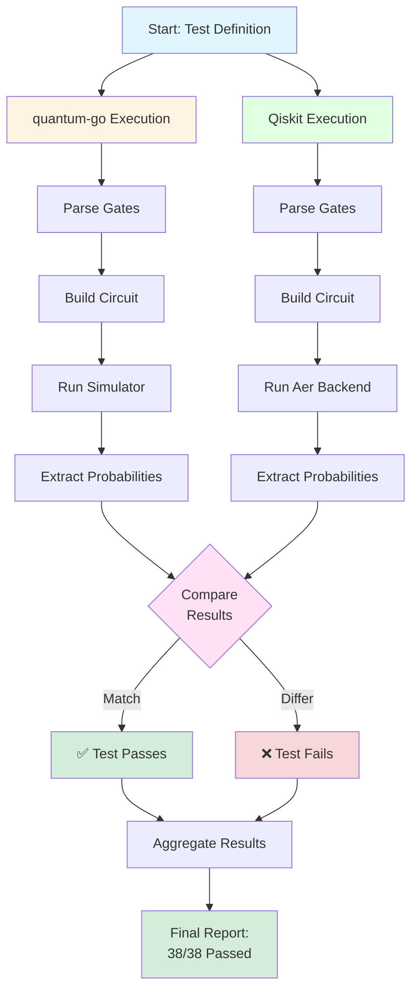

# Quick Verification Guide

This guide shows how to verify quantum-go quantum operations against Qiskit.

## Verification Process Diagram



## Quick Start

```bash
# 1. Set up Python environment (if not already done)
python3 -m venv .venv
source .venv/bin/activate  # On Windows: .venv\Scripts\activate
pip install qiskit qiskit-aer numpy

# 2. Build quantum-go CLI (if not already built)
cd go && go build -o quantum-go ./cmd/quantum-go && cd ..

# 3. Run verification
python3 verify_against_qiskit.py
```

## What Gets Verified

The script automatically verifies 38 quantum operations including:

**From Learning Transcript:**
- ✅ Single, two, and three qubit superposition
- ✅ Selective qubit operations
- ✅ Gate reversibility (H, X, Y, Z gates)
- ✅ Phase effects (Z gate behavior)
- ✅ Gate compositions and transformations
- ✅ Hadamard sandwiching (H·X·H, H·Z·H)

**From CLI Examples:**
- ✅ Identity, CNOT, CZ, SWAP gates
- ✅ Toffoli (CCNOT) three-qubit gate
- ✅ Phase rotation gates (U1, controlled-U1)
- ✅ Bell states and GHZ states
- ✅ Advanced multi-qubit combinations

## Expected Output

```
======================================================================
 quantum-go vs QISKIT VERIFICATION SUITE
======================================================================

Test: Single Qubit Superposition (H on q[0])
------------------------------------------------------------
State      quantum-go   Qiskit       Diff         Match
|0>            0.5000       0.5000     0.000000   ✓
|1>            0.5000       0.5000     0.000000   ✓

Overall Result: PASS ✓
```

## Understanding Results

- **PASS ✓**: Probabilities match within 0.0001 (0.01%)
- **FAIL ✗**: Probabilities differ (indicates implementation issue)
- **Summary**: Shows total passed/failed tests

## Manual Testing

You can also manually compare operations:

### quantum-go CLI
```bash
./go/quantum-go run -n 1 -s "h q[0]"
```

### Qiskit (Python)
```python
from qiskit import QuantumCircuit
from qiskit_aer import AerSimulator

qc = QuantumCircuit(1)
qc.h(0)
qc.save_statevector()

simulator = AerSimulator(method='statevector')
result = simulator.run(qc).result()
statevector = result.get_statevector()

for i, amp in enumerate(statevector):
    prob = abs(amp) ** 2
    if prob > 1e-10:
        print(f"|{i}>: {prob:.4f}")
```

## Adding Your Own Tests

Edit `verify_against_qiskit.py` and add to the `tests` array:

```python
{
    "name": "My Custom Test",
    "num_qubits": 2,
    "quantum_go_gates": "h q[0]; cx q[0] q[1]",  # quantum-go syntax
    "qiskit_gates": [("h", [0]), ("cx", [0, 1])]  # Qiskit gates
}
```

### Supported Gates

| Gate | quantum-go Syntax | Qiskit Name | Description |
|------|---------------|-------------|-------------|
| Hadamard | `h q[0]` | `h` | Superposition |
| Pauli-X | `x q[0]` | `x` | NOT gate |
| Pauli-Y | `y q[0]` | `y` | Y rotation |
| Pauli-Z | `z q[0]` | `z` | Phase flip |
| CNOT | `cx q[0] q[1]` | `cx` | Controlled-NOT |
| CZ | `cz q[0] q[1]` | `cz` | Controlled-Z |
| SWAP | `swap q[0] q[1]` | `swap` | Swap qubits |

## Troubleshooting

### quantum-go executable not found
```bash
cd go && go build -o quantum-go ./cmd/quantum-go && cd ..
```

### Python packages missing
```bash
pip install qiskit qiskit-aer numpy
```

### Different results
- Check quantum-go CLI is latest version
- Verify gate syntax matches documentation
- Report issue with specific test case

## Results Summary

**Current Status:** ✅ 38/38 tests passed (100%)

All fundamental and advanced quantum operations verified against IBM Qiskit.

## More Information

- **Detailed Report:** See `QISKIT_VERIFICATION_REPORT.md`
- **Learning Transcript:** See `quantum-learning-session-transcript.md`
- **quantum-go Documentation:** See `go/README.md`
