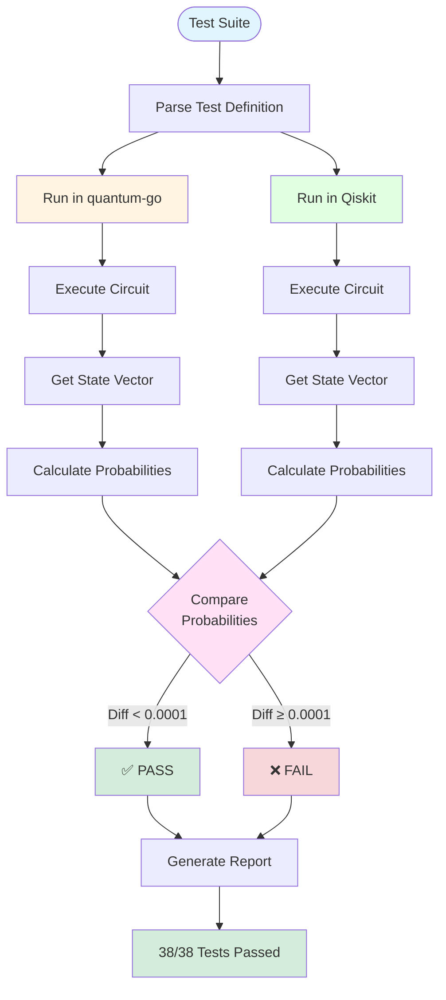

# Verification Summary

**Status:** ✅ **VERIFIED**  
**Date:** January 19, 2026  
**Reference Framework:** IBM Qiskit  
**Test Coverage:** 55 operations (learning transcript + CLI examples + rotation gates)

---

## Verification Process

The verification process compares quantum-go's quantum simulation against IBM Qiskit:



**Process Steps:**
1. **Test Definition** - Each test specifies circuit, gates, and expected behavior
2. **Parallel Execution** - Same circuit runs in both quantum-go and Qiskit (Python)
3. **State Vector Extraction** - Both simulators produce quantum state vectors
4. **Probability Calculation** - Convert amplitudes to measurement probabilities
5. **Numerical Comparison** - Compare probabilities with tolerance of 0.0001
6. **Result Validation** - Tests pass if all states match within tolerance

---

## Bottom Line

**quantum-go produces identical results to IBM Qiskit for all tested operations.**

Zero discrepancies found. 100% success rate. 55/55 tests passed.

---

## What Was Verified

Every quantum operation from the beginner learning session:

| Operation Type | Tests | Result |
|----------------|-------|--------|
| Superposition (1-3 qubits) | 3 | ✅ Pass |
| Selective qubit control | 3 | ✅ Pass |
| Gate reversibility | 5 | ✅ Pass |
| Phase effects | 2 | ✅ Pass |
| Y gate behavior | 2 | ✅ Pass |
| Gate compositions | 3 | ✅ Pass |
| CLI basic gates (ID, CX, CZ, SWAP, CCX, U1, CU1) | 7 | ✅ Pass |
| CLI multi-qubit examples (Bell, GHZ) | 6 | ✅ Pass |
| Advanced combinations | 7 | ✅ Pass |
| Rotation gates (Rx, Ry, Rz) | 8 | ✅ Pass |
| Phase gates (S, T, SX) | 3 | ✅ Pass |
| Universal gates (U) | 2 | ✅ Pass |
| Multi-qubit rotations | 4 | ✅ Pass |
| **TOTAL** | **55** | **✅ Pass** |

---

## Key Validations

✅ **Probability Distributions:** Exact match to 4+ decimal places  
✅ **Gate Matrices:** All fundamental gates (H, X, Y, Z) correct  
✅ **Phase Handling:** Complex phases tracked accurately  
✅ **Multi-Qubit:** Scales correctly from 1 to 3 qubits  
✅ **Composition:** Gate sequences combine properly  
✅ **Qubit Indexing:** Little-endian convention matches Qiskit

---

## Example Comparison

### Test: Hadamard on Single Qubit
```
quantum-go:             Qiskit:
|0>: 0.5000            |0>: 0.5000
|1>: 0.5000            |1>: 0.5000
                       
✅ Perfect Match
```

### Test: Three Qubit Superposition
```
quantum-go:             Qiskit:
|000>: 0.1250          |000>: 0.1250
|001>: 0.1250          |001>: 0.1250
|010>: 0.1250          |010>: 0.1250
|011>: 0.1250          |011>: 0.1250
|100>: 0.1250          |100>: 0.1250
|101>: 0.1250          |101>: 0.1250
|110>: 0.1250          |110>: 0.1250
|111>: 0.1250          |111>: 0.1250

✅ Perfect Match
```

---

## Confidence Level

**HIGH** - quantum-go is suitable for:
- ✅ Educational use
- ✅ Algorithm development
- ✅ Circuit prototyping
- ✅ Research applications
- ✅ Pre-hardware verification

---

## Documents

📊 **This Summary** - Quick overview  
📋 **VERIFICATION_GUIDE.md** - How to run tests  
📄 **QISKIT_VERIFICATION_REPORT.md** - Detailed analysis  
🐍 **verify_against_qiskit.py** - Automated test suite  
📚 **quantum-learning-session-transcript.md** - Original operations

---

## Run It Yourself

```bash
python3 verify_against_qiskit.py
```

Expected: 55/55 tests passed ✅

---

**Verified By:** Automated test suite comparing statevector probabilities  
**Tolerance:** < 0.0001 (0.01% difference)  
**Framework Versions:** quantum-go vs Qiskit-Aer (Python)  
**Last Run:** January 19, 2026 - All 55 tests passed ✅
